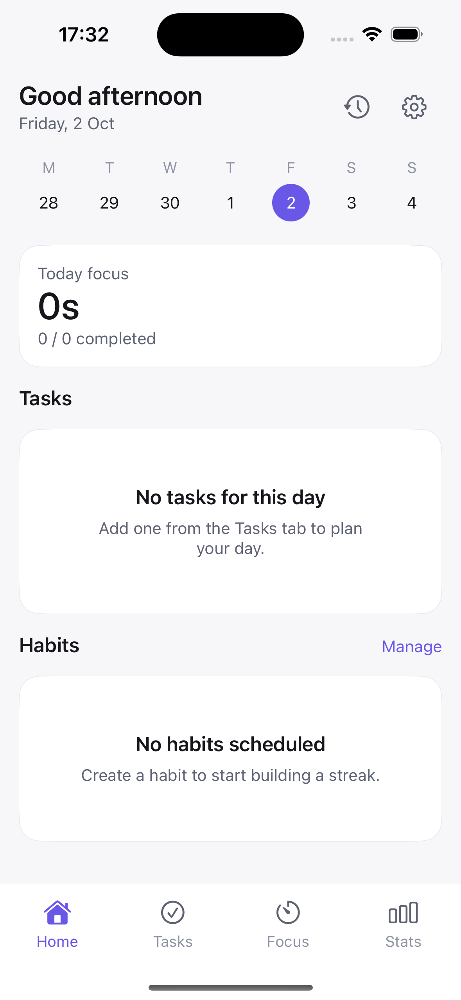

# FlowApp — iOS

An iOS port of [FlowApp](https://github.com/alwxezwei-del/FlowApp), my native Android productivity app (tasks, habits, focus timer, statistics).

## How it was built

The port was done with AI assistance (Claude + GPT) to translate the Android/Kotlin architecture and UI into SwiftUI. I then went through the generated project by hand: fixed the project structure and module layout, reworked the architecture to be idiomatic for iOS rather than a literal translation, and debugged the issues that came up from the port.

This was a deliberate way to get hands-on with Swift and SwiftUI quickly, starting from an architecture I already understood deeply from building the original app - not a claim of long standing professional iOS experience.

## Screenshot

## Features

Full feature parity with the Android version:

- **Tasks** - create, organize and track to dos
- **Habits** - recurring habit tracking
- **Focus timer** - a Pomodoro-style focus session timer
- **Statistics** - insights and progress over time

## Stack

- **UI:** SwiftUI
- **Testing:** unit tests (`FlowAppiOSTests`) and UI tests (`FlowAppiOSUITests`)

## Related

The original Android version: [FlowApp](https://github.com/alwxezwei-del/FlowApp)
